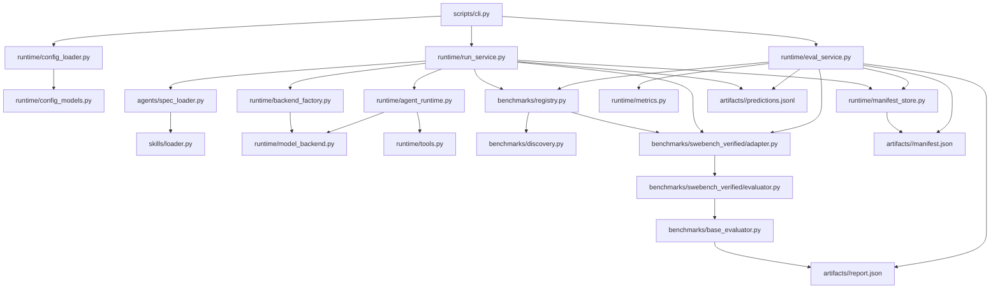

# Python Component Documentation

## Scope and Purpose
This document is a fast map of the Python runtime/evaluation stack so you can see what to edit when adding models, providers, or benchmarks.

Scope covered in this file:
- `profiles/agents/*`
- `profiles/runs/*`
- `profiles/prompts/*`
- `runtime/*`
- `benchmarks/*`
- `external/*` (third-party harnesses/assets used during eval)
- `skills/loader.py`
- `scripts/cli.py`
- `scripts/bootstrap.sh`
- `agents/spec_loader.py`

Important existing interfaces and types (no API changes in this doc):
- `benchmarks/contracts.py` (adapter/evaluator protocols)
- `runtime/schemas.py` (`BenchmarkTask`, `AgentResult`)
- `runtime/config_models.py` (typed run config schema)

## Benchmark Code vs External Assets
- Put runner-owned benchmark integration code in `benchmarks/<name>/` (`adapter.py`, optional `evaluator.py`).
- Put third-party harness code or vendor assets in `external/<project>/` (example: `external/SWE-bench`).
- Adapter discovery only scans `benchmarks/*/adapter.py` via `benchmarks/discovery.py`; nothing is discovered from `external/`.
- Use `evaluation.eval_root` to point evaluators at harness roots (often under `external/`).
- Use `benchmark.data_root` for local benchmark data/repo roots (can be under `external/`, but does not have to be).

### Use Cases for External Benchmark Repos
- Evaluation logic is owned by the benchmark project itself (for example, the SWE-bench harness), not by this runner.
- Bootstrap installs that harness from the local clone so `agent eval` can run it in the same virtual environment.
- `evaluation.eval_root` provides a concrete local preflight target for evaluator checks.
- `external/` cleanly separates third-party benchmark code from runner-owned code (`runtime/*`, `benchmarks/*`).

## Connectivity Diagram

## Where to Change Things
### New model on existing API
- Primary touchpoints: `profiles/agents/*.yaml` (model id), `profiles/prompts/*.txt` (prompt variants), `agents/spec_loader.py` (if spec keys change), `runtime/backend_factory.py` (if new backend config knobs), `runtime/model_backend.py` (if request payload/retry behavior changes).
- Usually unchanged: benchmark adapters/evaluators and run/eval orchestration.

### New API/provider integration
- Primary touchpoints: `runtime/model_backend.py` (new backend implementation), `runtime/backend_factory.py` (backend type dispatch), `agents/spec_loader.py` (new backend fields if needed).
- Validate run path integration in `runtime/run_service.py` and tool loop compatibility in `runtime/agent_runtime.py`.

### New benchmark/dataset/evaluator
- Primary touchpoints: new `benchmarks/<name>/adapter.py`, optional `benchmarks/<name>/evaluator.py`, shared contracts in `benchmarks/contracts.py`, discovery via `benchmarks/discovery.py` and lookup in `benchmarks/registry.py`.
- Placement rule: benchmark Python integration always lives under `benchmarks/<name>/`; use `external/` only for third-party harness/data dependencies referenced by config (`evaluation.eval_root`, `benchmark.data_root`).
- Keep run/eval services generic: `runtime/run_service.py` and `runtime/eval_service.py` should not need benchmark-specific branching.

### Core runtime behavior and artifacts
- Runtime loop/tooling: `runtime/agent_runtime.py`, `runtime/tools.py`, `runtime/artifact_policy.py`.
- Config and limits: `runtime/config_models.py`, `runtime/config_loader.py`.
- Artifact lifecycle and evaluation state: `runtime/run_service.py`, `runtime/eval_service.py`, `runtime/manifest_store.py`, `runtime/metrics.py`.

## Complete File Index (Concise)
| File | Responsibility | Edit When |
| --- | --- | --- |
| `scripts/cli.py` | Typer CLI entrypoint for `list`, `run`, `predict`, and `eval`; prints terminal summaries. | CLI flags/commands, command wiring, or output messaging changes. |
| `scripts/bootstrap.sh` | Bootstrap script that prepares `.venv`, clones SWE-bench under `external/`, and installs it editable. | Local setup workflow changes, external harness bootstrap path changes, or dependency bootstrap behavior changes. |
| `agents/spec_loader.py` | Loads agent YAML, resolves skills text, renders prompt, and returns allowed tools. | Agent spec schema, prompt templating, or skill resolution behavior changes. |
| `skills/loader.py` | Loads `SKILL.md` files and extracts `Allowed Tools` declarations. | Skill format parsing changes or tool-allowlist extraction rules change. |
| `runtime/__init__.py` | Empty package marker for the runtime module. | Only if adding runtime package-level exports or init-time behavior. |
| `runtime/agent_runtime.py` | Core model/tool execution loop with wall-time and tool-call budgets, plus submit termination. | Loop control, tool-call message handling, or termination semantics change. |
| `runtime/artifact_policy.py` | Normalizes/validates text, patch, and JSON artifacts with typed policy results. | Output validation rules or supported output types change. |
| `runtime/backend_factory.py` | Maps `backend.type` config to concrete backend instances. | Adding/changing provider backends or backend config options. |
| `runtime/config_loader.py` | Loads YAML run config, enforces strict nested shape, merges defaults, applies CLI overrides. | Config normalization, strictness, default values, or override behavior changes. |
| `runtime/config_models.py` | Pydantic models for benchmark/evaluation/runtime/output run config sections. | New config fields, field constraints, or section schema changes. |
| `runtime/eval_service.py` | Runs evaluator for a predictions file, parses metrics, and updates run manifest. | Eval path semantics, run-id derivation, or manifest evaluation payload changes. |
| `runtime/manifest_store.py` | Helpers for run ids, ISO timestamps, manifest read/write, and run log append. | Manifest format lifecycle helpers or logging timestamp behavior changes. |
| `runtime/metrics.py` | Reads `report.json` counts, computes derived rates, formats percentage output. | Metric keys/formulas or CLI metric formatting changes. |
| `runtime/model_backend.py` | Backend interface plus `OpenRouterBackend` request/retry logic and tool-call parsing. | Provider API integration, retry policy, or generation result parsing changes. |
| `runtime/run_service.py` | Orchestrates task execution, tool/runtime setup, prediction writing, and initial manifest creation. | Per-task execution pipeline, mode handling, or output artifact wiring changes. |
| `runtime/schemas.py` | Dataclasses for benchmark task input and per-task agent result output. | Runtime task/result fields or metadata contract changes. |
| `runtime/tools.py` | Tool registry and implementations (`workspace_*`, `bash`, `submit`) used by agent runtime. | Tool APIs, sandbox behavior, or tool execution safety checks change. |
| `benchmarks/__init__.py` | Empty package marker for benchmark adapters/evaluators. | Only if adding benchmark package-level exports or init-time behavior. |
| `benchmarks/base_evaluator.py` | Shared harness execution flow and canonical report/log relocation hooks. | Common evaluator orchestration or relocation behavior changes. |
| `benchmarks/contracts.py` | Protocol contracts for benchmark adapters and evaluators consumed by runtime services. | Adapter/evaluator method signatures or shared contract expectations change. |
| `benchmarks/discovery.py` | Auto-discovers adapter classes from `benchmarks/*/adapter.py` modules (not `external/*`). | Discovery conventions, adapter validation rules, or import strategy changes. |
| `benchmarks/registry.py` | Runtime adapter registry with optional overrides and deterministic lookup errors. | Registration override policy or benchmark lookup/list behavior changes. |
| `benchmarks/swebench_verified/__init__.py` | Empty package marker for SWE-bench verified integration module. | Only if adding module-level exports or init-time behavior. |
| `benchmarks/swebench_verified/adapter.py` | Loads SWE-bench tasks (HF/local), maps rows to `BenchmarkTask`, serializes prediction JSONL rows. | Dataset ingestion, task mapping, workspace resolution, or prediction schema mapping changes. |
| `benchmarks/swebench_verified/evaluator.py` | SWE-bench evaluator command builder, prediction schema guard, and harness log relocation. | Harness CLI arguments, prediction preflight checks, or log relocation structure changes. |

## Quick Playbooks
### Add a new model id (same provider)
1. Update model id in `profiles/agents/*.yaml` (`backend.model`).
2. If prompt wording changes are needed, edit or add files under `profiles/prompts/` and point `prompt_file` to the target file.
3. If new provider options are needed, thread them through `runtime/backend_factory.py`.
4. If payload/retry behavior differs for that model family, adjust `runtime/model_backend.py`.
5. Run one small `agent run` and `agent eval` smoke check to verify outputs and manifest fields.

### Add a new API/provider backend
1. Implement a backend class in `runtime/model_backend.py` that returns `GenerationResult`.
2. Route `backend.type` to the new class in `runtime/backend_factory.py`.
3. Extend agent YAML backend blocks and, if needed, parsing in `agents/spec_loader.py`.
4. Validate compatibility with `runtime/agent_runtime.py` tool-call loop and `runtime/run_service.py`.

### Add a new benchmark
1. Add `benchmarks/<name>/adapter.py` that satisfies `benchmarks/contracts.py`.
2. Add `benchmarks/<name>/evaluator.py` (or reuse `benchmarks/base_evaluator.py` pattern).
3. Confirm auto-discovery via `benchmarks/discovery.py` and selection via `benchmarks/registry.py`.
4. If evaluation needs a third-party harness or assets, place them under `external/<project>/` and set `evaluation.eval_root` in run config.
5. If loading local tasks/repos, set `benchmark.data_root` to that root (under `external/` or any other local path).
6. Keep orchestration generic by plugging the adapter into existing `runtime/run_service.py` and `runtime/eval_service.py`.

### Tune runtime/tool behavior
1. Change loop budgets/termination in `runtime/agent_runtime.py`.
2. Adjust tool behavior and safety checks in `runtime/tools.py`.
3. Update artifact validation rules in `runtime/artifact_policy.py`.
4. Add or expose config knobs in `runtime/config_models.py` and `runtime/config_loader.py`, then consume them in `runtime/run_service.py`.
